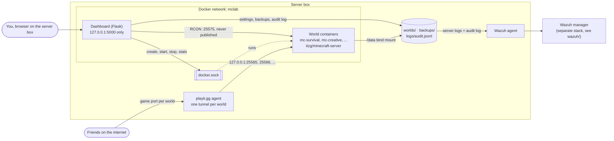

# Minecraft SIEM Lab

Self-hosted Minecraft servers (one per world) managed by a localhost-only Flask dashboard, with the game servers and the dashboard all monitored by Wazuh SIEM.

> Status: working prototype. The dashboard features below are built and tested with Docker and RCON mocked; a full run needs a machine with Docker.

## Architecture



- **One container per world.** The dashboard creates each `mc-<world>` container itself through the Docker socket; `docker-compose.yml` only runs the dashboard.
- **Only game ports leave the box**, through playit.gg. The dashboard listens on the host's loopback; RCON exists only on the internal `mclab` network.
- **Wazuh** reads two kinds of files: each world's server log and the dashboard's audit log. See [wazuh/README.md](wazuh/README.md).

## Worlds

Each world is its own Minecraft server: a separate `itzg/minecraft-server` container named `mc-<world>`. They are not defined in `docker-compose.yml`. The dashboard creates them through the Docker SDK, so adding a world is a dashboard action rather than a config edit.

Every world lives in its own directory:

```
worlds/
  survival/
    world.json        settings the dashboard edits
    data/             the container's /data (world/, server.properties, logs/)
  creative/
    ...
```

`world.json` is the source of truth for a world's settings. Its shape:

```json
{
  "name": "survival",
  "type": "SPIGOT",
  "version": "1.21.1",
  "memory": "2G",
  "port": 25565,
  "rcon_password": "<generated per world>",
  "properties": {
    "difficulty": "normal",
    "max-players": 10,
    "motd": "David's survival world",
    "pvp": true
  },
  "whitelist": ["player1", "player2"],
  "ops": ["player1"]
}
```

**How changing a setting works:** the dashboard saves `world.json`, then recreates the world's container with the matching itzg environment variables (`VERSION`, `MEMORY`, `DIFFICULTY`, `MOTD`, ...). The itzg image rewrites `server.properties` from those variables on every start, so the container config stays the single place settings come from. World data in `data/` is a bind mount and survives the recreate. Whitelist changes on a running server go through RCON so they apply without a restart.

Every world container gets the same fixed hardening regardless of `world.json`: online mode on, whitelist enforced, RCON enabled with a per-world random password and its port never published, joined to the `mclab` network, and labelled `mc-siem-lab.world=<name>` so the dashboard only ever touches its own containers.

**Ports:** each world needs its own host game port (25565, 25566, ...) and its own playit.gg tunnel entry pointing at it.

**Server software:** new worlds default to Spigot (`MC_DEFAULT_TYPE` in `.env`); the type stays editable per world. Spigot publishes no ready-made jar, so the dashboard sets itzg's `BUILD_FROM_SOURCE=TRUE` and the container builds Spigot with BuildTools on its first start and after a version change. That takes several minutes and needs network access to hub.spigotmc.org; the world page shows the build output (`data/spigot_build.log`) until the server's own log appears. The built jar is kept in `data/` and reused on later starts. Right after a new Minecraft release, `LATEST` can fail until Spigot catches up; pin a version like `1.21.1` if that happens.

## Security design

- **Dashboard is localhost-only.** Compose publishes it as `127.0.0.1:5000`, so it is unreachable from the LAN or the internet. It is never tunneled. Only the game port (25565) is exposed, through playit.gg.
- **RCON is internal.** Each world's RCON port (25575) exists only on the `mclab` Docker network and is never published on the host. Each world has its own random RCON password.
- **Secrets live in `.env`**, which is gitignored. `.env.example` documents every variable.
- **Game access control:** online mode (Microsoft account verification) plus an enforced whitelist, forced on for every world.
- **Docker socket:** the dashboard mounts `/var/run/docker.sock` to create and control world containers. That is root-equivalent on the host, which is part of why the dashboard stays local and behind a login.
- **Login:** one admin account whose password is stored only as an argon2 hash (`dashboard/scripts/hash_password.py`). Sessions are HttpOnly, SameSite=Strict cookies that expire after 8 hours. Every form, including logout and all world actions, carries a CSRF token.
- **Lockout:** 5 failed logins for a username/IP pair within 15 minutes locks it for 15 minutes (tunable in `.env`).
- **Audit log:** every login, logout and dashboard action is one JSON line in `logs/audit.jsonl` (format in `dashboard/mcdash/audit.py`), which Wazuh alerts on.
- **Deleting is reversible:** deleting a world needs its name typed in, only works while it's stopped, and moves its folder to `worlds/.deleted/` instead of erasing it.

## Setup

1. Install Docker and Docker Compose on the server.
2. Clone this repo and copy the env file:
   ```sh
   cp .env.example .env
   ```
   Fill in `FLASK_SECRET_KEY` and the admin password hash.
3. Start the dashboard:
   ```sh
   docker compose up -d --build
   ```
4. Open http://localhost:5000 on the server box and create a world. To bring in a world from somewhere else, see [Importing an existing world](#importing-an-existing-world).
5. Point a playit.gg tunnel at each world's port (`localhost:25565`, `localhost:25566`, ...).

## Importing an existing world

A world from another host (vanilla, Paper, a hosting service, ...) can be moved into a new world here. What carries over is everything inside the world folder: terrain, the nether and end, and per-player data (inventories, positions, advancements and stats, in `playerdata/`, `advancements/` and `stats/`). Whitelist and ops don't come from the old files; add players on the world's page.

1. **Create the world** in the dashboard, say `kingdoms`, and **don't start it yet**.
2. **Set the version** on its page to the Minecraft version the old server ran, or newer. Opening a world in an older version than it was last saved with can corrupt it.
3. **Copy the old world folder** to `worlds/kingdoms/data/world`. It's the folder holding `level.dat`; on the old host it may have another name (whatever `level-name` was in its `server.properties`), but here it must be called `world`.
   - If the old host was Spigot or Paper, it also has `world_nether` and `world_the_end` folders next to it. Copy those to `worlds/kingdoms/data/` too.
   - If it was vanilla, the nether and end are inside the world folder (`DIM-1`, `DIM1`). Leave them there; Spigot moves them to `world_nether` and `world_the_end` on its first start.
   - Leave out the old host's `server.properties`, `whitelist.json` and `ops.json`: the dashboard writes those from `world.json`.
4. **On Linux, give the files to the server's user** (UID 1000 in the itzg image): `sudo chown -R 1000:1000 worlds/kingdoms/data`.
5. **Whitelist your players**, then **start** the world. The first Spigot start builds the server first, so it takes several minutes; watch the log on the world page.
6. Join and check, then press **Back up now** so you have a known-good copy.

Player data is keyed by account UUID. Every world here runs in online mode, so players keep their inventories only if the old server was also online mode (the normal case for paid accounts). If it ran in offline mode, each player's `playerdata/<uuid>.dat` was saved under an offline UUID and they'll start fresh.

## Backups

- **Back up now** on a world's page writes `backups/<world>/<world>-<UTC time>.tar.gz`. On a running server it pauses autosave and flushes the world to disk first.
- **Scheduled:** every running world is backed up every `BACKUP_INTERVAL_HOURS` (default 24, `0` turns it off), counted from its newest backup, so a dashboard restart doesn't reset the clock. Stopped worlds are skipped because their data can't change.
- **Retention:** after each backup, manual or scheduled, all but the newest `BACKUP_RETENTION` (default 10) backups of that world are deleted. `0` keeps everything.
- **Restore:** stop the world, move `worlds/<world>/data` aside, then extract the archive into a fresh one: `mkdir worlds/<world>/data && tar -xzf backups/<world>/<file>.tar.gz -C worlds/<world>/data --strip-components=1` (the archive holds a `<world>/` folder with the contents of `data/`).

## Deleting a world

On the world's page, stop it, type its name and press **Delete world**. The container is removed and `worlds/<world>` moves to `worlds/.deleted/<world>-<UTC time>`; backups stay in `backups/<world>`. To undo, move the folder back to `worlds/<world>` (the world shows up again; it gets a fresh container on start). To free the disk space for good, delete the folder under `worlds/.deleted/` by hand.

## Features

- [x] Create / delete worlds, each as its own server container
- [x] Edit per-world settings (version, memory, difficulty, MOTD, ...)
- [x] Start / stop / restart each world (Docker SDK)
- [x] Server log view per world (last 200 lines, refresh to update)
- [x] Online player list and whitelist management per world (RCON)
- [x] Manual timestamped world backups
- [x] Login with hashed passwords, sessions, CSRF protection, lockout
- [x] Scheduled backups with retention
- [x] Auto-restart on crash (Docker restart policy `unless-stopped`)
- [x] Container CPU/RAM stats per world
- [x] Audit log of every dashboard action, with Wazuh rules
- [ ] Live-updating console (send commands, stream the log)

## Wazuh integration

Decoders, rules, the agent's `localfile` config, sample logs and install steps are in [wazuh/README.md](wazuh/README.md). In short, Wazuh alerts on:

- Failed dashboard logins, brute force and lockouts, and any login from off the box
- Non-whitelisted players trying to join any world, and repeated attempts
- Crashes, watchdog kills and crash loops
- Admin actions from the dashboard: starts, stops, whitelist and settings changes, backups, world creation and deletion

## Repository layout

```
docker-compose.yml   Dashboard service and the mclab network
.env.example         Dashboard config and defaults for new worlds, no real values
dashboard/           Flask app (mcdash/) and its tests
wazuh/               Wazuh decoders, rules, agent config and sample logs
worlds/              One directory per world (gitignored, created by the dashboard);
                     deleted worlds go to worlds/.deleted/
backups/             World backups (gitignored)
logs/                Dashboard audit log (gitignored)
```
