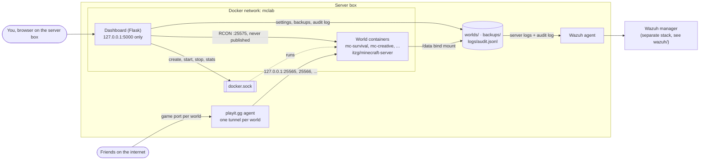

# Architecture and security design

How the pieces fit together, and why the dashboard is built the way it is.

## Overview

- **One container per world.** The dashboard creates each `mc-<world>` container itself through the Docker socket; `docker-compose.yml` only runs the dashboard.
- **Only game ports leave the box**, through playit.gg. The dashboard listens on the host's loopback; RCON exists only on the internal `mclab` network.
- **Wazuh** reads two kinds of files: each world's server log and the dashboard's audit log. See [wazuh.md](wazuh.md) and [wazuh/README.md](../wazuh/README.md).
- **World settings** live in each world's `world.json`; see [worlds.md](worlds.md#where-a-world-lives) for how a change reaches the server.

## Security design

- **Dashboard is localhost-only.** Compose publishes it as `127.0.0.1:5000`, so it is unreachable from the LAN or the internet. It is never tunneled. Only the game port (25565) is exposed, through playit.gg.
- **RCON is internal.** Each world's RCON port (25575) exists only on the `mclab` Docker network and is never published on the host. Each world has its own random RCON password.
- **Secrets live in `.env`**, which is gitignored. `.env.example` documents every variable.
- **Game access control:** online mode (Microsoft account verification) plus an enforced whitelist, forced on for every world.
- **Docker socket:** the dashboard mounts `/var/run/docker.sock` to create and control world containers. That is root-equivalent on the host, which is part of why the dashboard stays local and behind a login.
- **Login:** one admin account whose password is stored only as an argon2 hash (`dashboard/scripts/hash_password.py`). Sessions are HttpOnly, SameSite=Strict cookies that expire after 8 hours. Every form, including logout and all world actions, carries a CSRF token.
- **Lockout:** 5 failed logins for a username/IP pair within 15 minutes locks it for 15 minutes (tunable in `.env`).
- **Audit log:** every login, logout and dashboard action is one JSON line in `logs/audit.jsonl` (format in `dashboard/mcdash/audit.py`), which Wazuh alerts on.
- **Deleting is reversible:** deleting a world needs its name typed in, only works while it's stopped, and moves its folder to `worlds/.deleted/` instead of erasing it.

